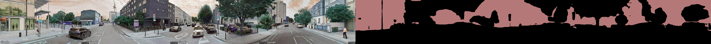
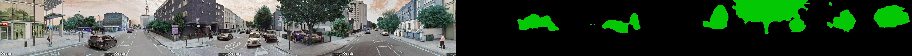
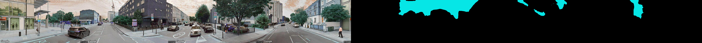

# Streetview Segmentation

Developed based on [**semantic-segmentation-pytorch**](https://github.com/CSAILVision/semantic-segmentation-pytorch "**semantic-segmentation-pytorch**") by MIT

### Dependency:

- numpy
- scipy
- pytorch==0.4.1
- torchvision
- opencv3
- yacs
- tqdm

### Introduction

对街景图片进行语义分割可以帮助我们对城市特定空间位置的布局结构，城市要素构成，建成环境指数等定量化指标进行量化分析，包括但不限于以下研究：

- 城市绿视率计算
- 人/车流量计算
- 空间围合感
- 视觉建筑占比

本仓库与街景爬取代码[streetview_images_crawler](https://github.com/kingsley0107/streetview_images_crawler "streetview_images_crawler")配合食用进行大规模批量化处理效果更佳

### Performance:

- 提取 buildings:

- 提取 Trees:

- 提取 Sky:

### Startup:

1. [下载预训练模型权重文件](https://drive.google.com/drive/folders/1Oo_me-tc6vD4Q_kAFWeaxRAQ8jBJTe7E "下载预训练模型权重文件")，并将其置于该代码文件夹同一路径下
2. 将目标图片放置在./images 文件夹内(已放置一张示例图片)
3. 运行 segmentation_example.ipynb

### Segmentation Types:

[根据官方文档解释](https://docs.google.com/spreadsheets/d/1se8YEtb2detS7OuPE86fXGyD269pMycAWe2mtKUj2W8/edit#gid=0 "根据官方文档解释")，该模型可以分割出 150 种不同的城市要素。每种城市要素对应一个 index，选出你想要的对象 index 并替换 notebook 中的 visualize_result()函数内参数。

### Disclaimer:

本仓库代码完全基于[MIT CSAIL Computer Vision](https://github.com/CSAILVision "MIT CSAIL Computer Vision")开源代码进行二次封装

Copyright (c) 2019, MIT CSAIL Computer Vision
All rights reserved.
